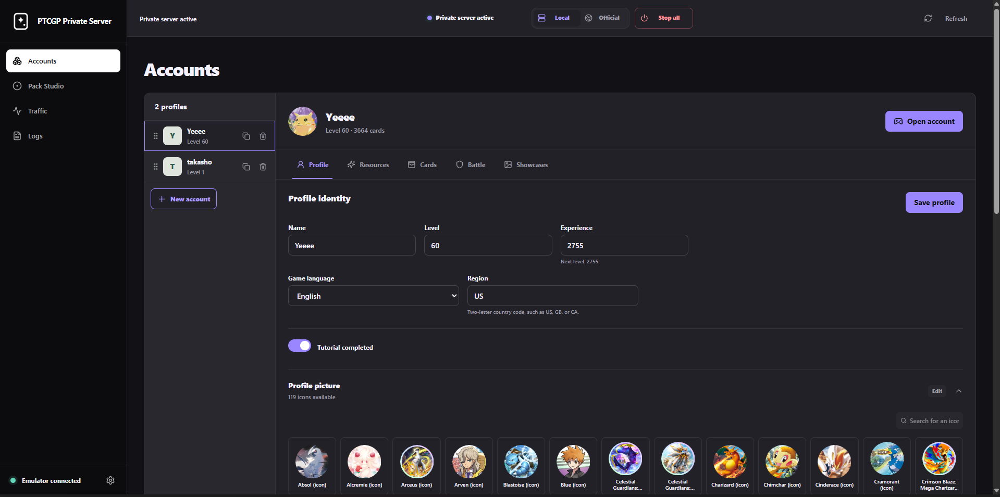

# PTCGP Private Server

Run Pokémon TCG Pocket against your own local server, create separate profiles,
edit their collections, and control pack openings from a browser.

> [!IMPORTANT]
> This is an unofficial, local-only interoperability project for advanced
> users. It currently supports Pokémon TCG Pocket **1.7.2** on Windows with a
> rooted Android emulator. It is not affiliated with Nintendo, The Pokémon
> Company, Creatures Inc., or DeNA.

[Download the latest release](https://github.com/Layen-lang/PTCGP-Private-Server/releases/latest)
· [Installation guide](docs/INSTALLATION.md)
· [User guide](docs/USAGE.md)
· [Troubleshooting](docs/TROUBLESHOOTING.md)

## See it in action

Manage independent local profiles, resources, collections, and cosmetics from
the control panel.

Open a local profile in the game and experiment with its collection without
touching an official account.

  

## What can you do with it?

- Create, duplicate, reorder, edit, and delete independent local profiles.
- Change a profile's level, experience, resources, cards, emblems, and
  cosmetics.
- Open a selected local profile directly in the game.
- Keep official pack odds or force a table, rarity, exact composition, or
  custom nonstandard pack.
- Inspect sanitized HTTP and gRPC traffic and follow launcher logs live.
- Switch safely between the private server and the official service.

Local profiles are stored in SQLite on your computer. They do not replace or
modify your official account. PvP matchmaking and the bidirectional
`Battle/Connect` stream are not implemented.

## Before you start

You need:

- Windows 10 or later;
- Pokémon TCG Pocket **1.7.2**, installed by you;
- an ARM64 Android emulator with ADB, root access, `adb reverse`, and writable
  system mounts;
- `adb.exe` available in `PATH`.

You do **not** need Go or Node.js when using a published release. Those tools
are only required to run the project from source.

> [!CAUTION]
> Local mode temporarily changes Android routing, installs a local certificate
> authority, and applies a hash-verified patch to one game library. Always use
> **Official** before signing in to an official account. Never expose ports
> `443`, `8080`, or `8081` to your network or the Internet.

## Install in 5 minutes

1. Download the ZIP from the
   [latest release](https://github.com/Layen-lang/PTCGP-Private-Server/releases/latest).
2. Extract the complete archive to a writable folder. Do not run it from inside
   the ZIP.
3. Start your rooted emulator and wait for Android to finish booting.
4. Open Command Prompt and check that `adb devices` lists the emulator as
   `device`.
5. Double-click `start-server.cmd`. The control panel opens at
   <http://127.0.0.1:8080>.

If any requirement is unclear, follow the
[step-by-step installation guide](docs/INSTALLATION.md) before continuing.

## First local profile

1. In the control panel, select **Local** and wait for **Private server
   active**.
2. Open **Accounts**, select **New account**, and choose an empty or complete
   inventory.
3. Adjust the profile if needed, then select **Open account**.
4. When you finish, select **Official** to restore normal game routing, or
   **Stop all** to restore it and close the local tools.

The [user guide](docs/USAGE.md) explains every section of the control panel and
the safest daily workflow.

## Documentation

| Guide | For |
| --- | --- |
| [Documentation index](docs/README.md) | Finding the right guide |
| [Installation](docs/INSTALLATION.md) | Releases, source setup, and emulator checks |
| [Using the server](docs/USAGE.md) | Modes, profiles, packs, traffic, and backups |
| [Troubleshooting](docs/TROUBLESHOOTING.md) | Startup, ADB, root, ports, and recovery |
| [Configuration](docs/CONFIGURATION.md) | `server.json`, environment variables, and CLI |
| [Architecture](docs/ARCHITECTURE.md) | Components, ports, data flow, and boundaries |
| [Game data](docs/GAME-DATA.md) | Runtime data layout and compatibility |
| [Development](docs/DEVELOPMENT.md) | Build, test, and release workflow |

Also see [Security](SECURITY.md), [Contributing](CONTRIBUTING.md), the
[changelog](CHANGELOG.md), and the [third-party notice](NOTICE.md).

## Data and privacy

The project stays on your machine by default:

| Path | Contents |
| --- | --- |
| `data/` | Profiles, SQLite database, logs, and runtime state |
| `certs/` | Locally generated certificate authority and private key |
| `game-data/` | Read-only curated runtime data shipped with the project |

`data/` and `certs/` are ignored by Git. Treat them as private and never attach
them to a public issue without carefully reviewing their contents.

## License and third-party material

Original project code is available under the [MIT License](LICENSE). Pokémon
names, artwork, and game data remain the property of their respective owners
and are not covered by that license. See [NOTICE.md](NOTICE.md) for details.
